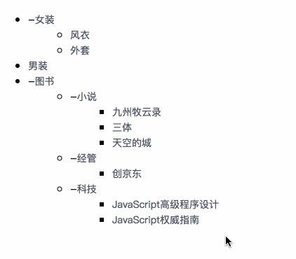

# vue-draggable-tree

> 可拖拽 vue 树



## Example

online example: https://ltaoo.github.io/vue-draggable-tree/examples/index.html

## Install

```bash
yarn add vue-draggable-tree
```

## Usage

```javascript
<template>
    <Tree
        draggable
        v-model="data"
        :afterInsert="afterInsert"
    ></Tree>
</template>

<script>
import Tree from '../tree';

const EXAMPLE_DATA = [
    {
        key: '0',
        title: '女装',
        children: [
            {
                key: '0-1',
                title: '风衣',
            },
            {
                key: '0-2',
                title: '外套',
            },
        ],
    },
    {
        key: '1',
        title: '男装',
    },
    {
        key: '2',
        title: '图书',
        children: [
            {
                key: '2-0',
                title: '小说',
                children: [
                    {
                        key: '2-0-0',
                        title: '九州牧云录',
                    },
                    {
                        key: '2-0-1',
                        title: '天空的城',
                    },
                    {
                        key: '2-0-2',
                        title: '三体',
                    },
                ],
            },
            {
                key: '2-1',
                title: '经管',
                children: [
                    {
                        key: '2-1-0',
                        title: '创京东',
                    },
                ],
            },
            {
                key: '2-2',
                title: '科技',
                children: [
                    {
                        key: '2-2-0',
                        title: 'JavaScript权威指南',
                    },
                    {
                        key: '2-2-1',
                        title: 'JavaScript高级程序设计',
                    },
                ],
            },
        ],
    },
];

export default {
    name: 'vue-draggable-tree-demo',
    components: {
        Tree,
    },
    data() {
        return {
            data: EXAMPLE_DATA,
        };
    },
    methods: {
        afterInsert() {
            console.log(this.data);
        },
    },
};
</script>

<style>

</style>
```

## API

属性 | 说明 | 类型 | 默认值 |
---|---|---|---|
data | 要渲染的数据 | Array | 空
draggable | 设置节点可拖拽（IE>8）| Boolean | false
onDragEnd | dragend 触发时调用 | function({event, node}) | -
onDragEnter | dragenter 触发时调用 | function({event, node}) | -
onDragLeave | dragleave 触发时调用 | function({event, node}) | -
onDragOver | dragover 触发时调用 | function({event, node}) | -
onDragStart | dragstart 触发时调用 | function({event, node}) | -
onDrop | drop 触发时调用 | function({event, node}) | -
onExpand | 展开/收起节点时触发 | function({event, node}) | -
afterInsert | 在节点插入到指定位置后调用 | function() | -
template | 自定义节点内容 | VueComponent | -
<<<<<<< HEAD

## todo

[] 增加 checkbox
[] 增加 theme 以方便直接在 iview 或者 element 项目中使用
[] examples 展示页用例完善
[] 代码整理
=======
>>>>>>> 500da94fffcbfe5193e13cacbc78874e4a97681b
